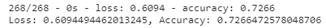

# Neural_Network_Charity_Analysis

## Overview of the analysis:
Using deep learning methods, analyze a CSV containing over 34000 organizations that received funding from Alphabet Soup to create a model that predicts high risk organizations with over 75% accuracy

## Results:
Overall, five neural net models were trained and evaluated against the dataset. None of the models performed with the expected accuracy.

* Data Processing:
  - Binary variable in `IS_SUCESSFUL` column was considered as target for the models
  - `['APPLICATION_TYPE', 'AFFILIATION', 'CLASSIFICATION', 'USE_CASE', 'ORGANIZATION', 'STATUS', 'INCOME_AMT', 'SPECIAL_CONSIDERATIONS', 'ASK_AMT']` were considered to be features for the models
  - `['EIN', 'NAME']` were neither targets nor features for the models

* Compiling, Training, and Evaluating the model
  - Original model `nn` is constituted by 2 hidden layers with 80 and 30 neurons respectively, and an output layer. Hidden layers used 'relu' activation function while the output layer used the 'sigmoid' function because there no negative inputs are expected.
  - `nn` model did not achieve target results with the following performance: 
    
  - In order to increase the model performance, analysis was performed using the strategies described in the 'Optimization' section.

### Optimization results:
Optimization was conducted by training and evaluating four additional deep learning models with the following changes in the dataset or parameters of the models:

1. model `nn2` was trained and evaluated with a dataset in which the outliers in`['ASK_AMT']` were trimmed using the IQR method. Model performance was lower than the original with the following results: 
  

2. model `nn3` was trained and evaluated on the original (untrimmed) dataset with increased number of neurons in hidden layer 2 (added 10 to make it 50% of hidden layer 1), and with an additional hidden layer with 20 neurons (50% of hidden layer 2). No improvements in model performance were achieved: 
  

3. model `nn4` was trained with double the number of epochs of the original `nn3` model (200 epochs). Model performance showed no improvement: 
  

4. model `nn5` was trained with changed activation functions of the `nn3` model: hidden layers 2 and 3 changed from 'relu' to 'tanh'. The model failed to achieve any improvement in performance: 
  

## Summary
